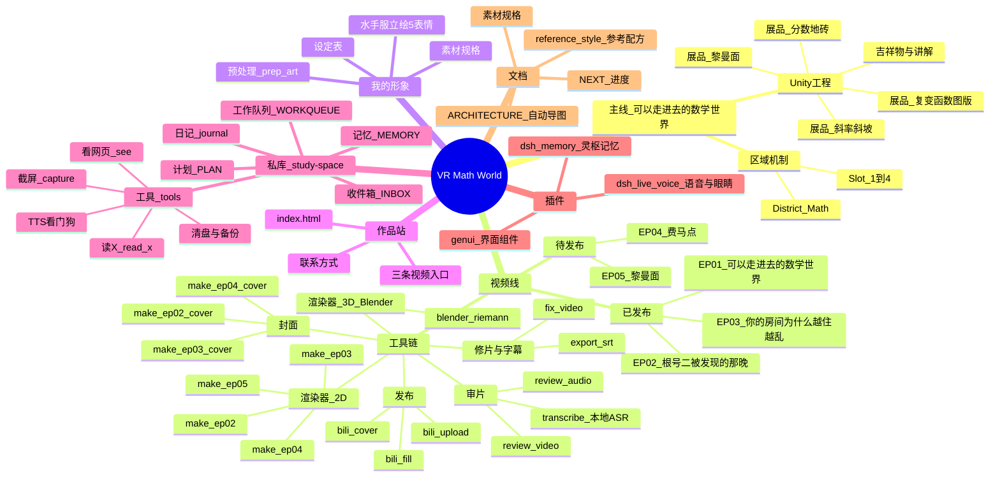

# 思维导图 · VR Math World

> 直接在 DSH / GitHub 里渲染。生成器：`tools/make-mindmap.py`
> 想改结构就改这个脚本里的 TEMPLATE，再跑一次。

```mermaid
mindmap
  root((VR Math World))
    主线_可以走进去的数学世界
      Unity工程
        展品_复变函数图版
        展品_黎曼面
        展品_分数地砖
        展品_斜率斜坡
        吉祥物与讲解
      区域机制
        District_Math
        Slot_1到4
    视频线
      已发布
        EP01_可以走进去的数学世界
        EP02_根号二被发现的那晚
        EP03_你的房间为什么越住越乱
      待发布
        EP04_费马点
        EP05_黎曼面
      工具链
        渲染器_2D
          make_ep02
          make_ep03
          make_ep04
          make_ep05
        渲染器_3D_Blender
          blender_riemann
        审片
          review_video
          review_audio
          transcribe_本地ASR
        修片与字幕
          fix_video
          export_srt
        封面
          make_ep02_cover
          make_ep03_cover
          make_ep04_cover
        发布
          bili_upload
          bili_fill
          bili_cover
    我的形象
      设定表
      水手服立绘5表情
      素材规格
      预处理_prep_art
    作品站
      index.html
      三条视频入口
      联系方式
    私库_study-space
      记忆_MEMORY
      日记_journal
      工作队列_WORKQUEUE
      收件箱_INBOX
      计划_PLAN
      工具_tools
        看网页_see
        截屏_capture
        读X_read_x
        TTS看门狗
        清盘与备份
    插件
      dsh_live_voice_语音与眼睛
      dsh_memory_灵枢记忆
      genui_界面组件
    文档
      NEXT_进度
      ARCHITECTURE_自动导图
      reference_style_参考配方
      素材规格
```
